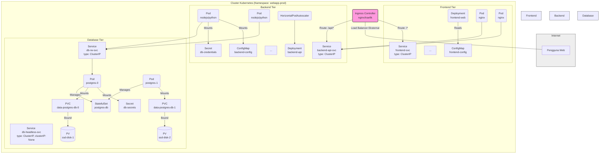

# Studi Kasus: Arsitektur Aplikasi Web Multi-Tier di Kubernetes

Ini adalah salah satu pola arsitektur paling umum yang di-deploy di Kubernetes: aplikasi web klasik yang terdiri dari beberapa lapisan (tiers), biasanya frontend, backend API, dan database.

**Tujuan:** Menunjukkan bagaimana berbagai objek Kubernetes (Deployment, Service, ConfigMap, Secret, PersistentVolumeClaim, Ingress) bekerja sama untuk membangun dan mengelola aplikasi multi-tier yang scalable dan tangguh.

## Komponen Aplikasi Contoh

Kita akan anggap aplikasi kita terdiri dari:

1.  **Frontend (React/Vue/Angular SPA):** Aplikasi web statis (HTML, CSS, JS) yang disajikan oleh server web ringan seperti Nginx. Berkomunikasi dengan Backend API.
2.  **Backend API (Node.js/Python/Go):** API RESTful stateless yang menangani logika bisnis dan berinteraksi dengan database.
3.  **Database (PostgreSQL/MySQL):** Penyimpanan data persisten stateful.

## Arsitektur Target di Kubernetes

## Implementasi Komponen Kubernetes

1.  **Namespace:**
    *   Buat Namespace khusus, misalnya `webapp-prod`, untuk mengisolasi semua sumber daya aplikasi ini.
    *   `kubectl create namespace webapp-prod`

2.  **Database Tier (PostgreSQL):**
    *   **StatefulSet (`postgres-db`):** Karena database bersifat stateful, kita gunakan StatefulSet.
        *   `replicas`: 2 (Contoh: satu primary, satu standby/read-replica - logika replikasi perlu diatur di dalam image/konfigurasi PostgreSQL itu sendiri atau menggunakan Operator DB).
        *   `serviceName: db-headless-svc`: Menunjuk ke Headless Service untuk identitas jaringan stabil.
        *   `selector`: `app: postgres, tier: database`
        *   `template`:
            *   `metadata.labels`: `app: postgres, tier: database`
            *   `spec.containers[]`: Image PostgreSQL (`postgres:15`), port 5432, konfigurasi (mungkin dari ConfigMap), variabel environment untuk user/password/database (dari `SecretDB`), `livenessProbe`/`readinessProbe` (cek koneksi DB).
            *   `volumeMounts`: Mount volume persisten ke path data PostgreSQL (`/var/lib/postgresql/data`).
        *   `volumeClaimTemplates`: Mendefinisikan template PVC (`data`) yang akan secara otomatis membuat PVC unik (`data-postgres-db-0`, `data-postgres-db-1`) untuk setiap Pod.
            *   `accessModes: [ReadWriteOnce]`
            *   `storageClassName: fast-ssd` (Contoh)
            *   `resources.requests.storage: 50Gi` (Contoh)
    *   **Secret (`db-secrets`):** Menyimpan password superuser PostgreSQL dan mungkin password user aplikasi. Dibuat secara manual atau oleh proses setup awal. Di-mount sebagai env var atau file ke Pods StatefulSet.
    *   **Headless Service (`db-headless-svc`):**
        *   `type: ClusterIP`, `clusterIP: None`
        *   `selector: app: postgres, tier: database`
        *   `ports`: Port 5432.
        *   Menyediakan entri DNS stabil untuk setiap Pod (misalnya, `postgres-db-0.db-headless-svc.webapp-prod.svc.cluster.local`). Berguna untuk discovery antar replika DB.
    *   **Service Read/Write (`db-rw-svc`):**
        *   `type: ClusterIP`
        *   `selector: app: postgres, tier: database, role: primary` (Membutuhkan label `role=primary` di-set pada Pod primary DB - ini mungkin diatur oleh Operator atau skrip startup).
        *   `ports`: Port 5432.
        *   Menyediakan satu endpoint stabil untuk Backend API terhubung ke instance primary database. *Catatan: Mengelola failover dan memastikan service ini selalu menunjuk ke primary yang benar seringkali memerlukan logika tambahan (Operator atau solusi eksternal).*
    *   **PersistentVolumeClaims (PVCs):** `data-postgres-db-0`, `data-postgres-db-1` (dibuat otomatis oleh StatefulSet dari `volumeClaimTemplates`).
    *   **PersistentVolumes (PVs):** Dibuat dinamis oleh `fast-ssd` StorageClass (atau statis jika provisioning manual).

3.  **Backend API Tier (Node.js/Python):**
    *   **Deployment (`backend-api`):** Aplikasi API bersifat stateless, jadi Deployment cocok.
        *   `replicas`: 3 (Contoh, bisa disesuaikan atau dikelola HPA).
        *   `selector`: `app: my-app, component: backend-api`
        *   `strategy`: `RollingUpdate` (default).
        *   `template`:
            *   `metadata.labels`: `app: my-app, component: backend-api`
            *   `spec.containers[]`: Image aplikasi backend, port ekspos (misalnya 3000), `readinessProbe`/`livenessProbe` (cek endpoint `/healthz`).
            *   `envFrom` / `env`:
                *   Merujuk ke `Secret` `db-credentials` untuk mendapatkan DSN/kredensial database.
                *   Merujuk ke `ConfigMap` `backend-config` untuk konfigurasi lain (misalnya, URL layanan eksternal, level log).
            *   `resources`: Tentukan `requests` dan `limits` CPU/Memori.
    *   **Secret (`db-credentials`):** Menyimpan username/password khusus untuk aplikasi backend mengakses database. Berbeda dari `db-secrets` (superuser). Dibuat manual.
    *   **ConfigMap (`backend-config`):** Menyimpan URL database (menggunakan nama Service `db-rw-svc`), level log, dll.
    *   **Service (`backend-api-svc`):**
        *   `type: ClusterIP`
        *   `selector: app: my-app, component: backend-api`
        *   `ports`: Port 80 (atau 443 jika internal TLS) menargetkan port kontainer (misalnya 3000).
        *   Menyediakan endpoint internal stabil untuk Frontend dan Ingress Controller.
    *   **HorizontalPodAutoscaler (`backend-api-hpa`) (Opsional):**
        *   Mengawasi Deployment `backend-api`.
        *   Men-scale `replicas` secara otomatis (misalnya, antara 3 dan 10) berdasarkan target penggunaan CPU (misalnya, 75%).

4.  **Frontend Tier (Nginx):**
    *   **Deployment (`frontend-web`):** Menyajikan file statis, jadi stateless.
        *   `replicas`: 2 (Contoh).
        *   `selector`: `app: my-app, component: frontend-web`
        *   `template`:
            *   `metadata.labels`: `app: my-app, component: frontend-web`
            *   `spec.containers[]`: Image Nginx (`nginx:stable-alpine`) atau image kustom yang berisi build SPA (React/Vue). Port 80.
            *   `volumeMounts` (Opsional): Me-mount `ConfigMap` `frontend-config` yang berisi konfigurasi Nginx kustom (misalnya, untuk routing sisi klien SPA atau pengaturan cache).
            *   `resources`: Tentukan `requests` dan `limits`.
    *   **ConfigMap (`frontend-config`) (Opsional):** Menyimpan file `nginx.conf` kustom.
    *   **Service (`frontend-svc`):**
        *   `type: ClusterIP`
        *   `selector: app: my-app, component: frontend-web`
        *   `ports`: Port 80 menargetkan port 80 kontainer.
        *   Menyediakan endpoint internal stabil untuk Ingress Controller.

5.  **Ingress:**
    *   **Ingress Controller:** Deployment Ingress Controller (seperti Nginx Ingress atau Traefik) berjalan di cluster (biasanya di namespace sendiri), diekspos ke internet melalui Service tipe `LoadBalancer` (di cloud) atau `NodePort`.
    *   **Resource `Ingress` (`my-app-ingress`):** Dibuat di namespace `webapp-prod`.
        *   Mendefinisikan aturan routing berbasis host/path.
        *   `rules`:
            *   Host: `my-app.example.com` (Contoh)
                *   Path: `/api/*` -> Backend: `backend-api-svc`, Port: 80
                *   Path: `/*` -> Backend: `frontend-svc`, Port: 80
        *   (Opsional) `tls`: Mengkonfigurasi sertifikat TLS (biasanya disimpan dalam Secret) untuk HTTPS.

## Alur Kerja Request Pengguna

1.  Pengguna mengakses `https://my-app.example.com` di browser.
2.  DNS me-resolve domain ke IP eksternal Load Balancer Ingress Controller.
3.  Load Balancer meneruskan traffic ke salah satu Pod Ingress Controller.
4.  Ingress Controller memeriksa aturan Ingress `my-app-ingress`.
5.  Karena path adalah `/` (root), request diteruskan ke ClusterIP Service `frontend-svc`.
6.  `frontend-svc` melakukan load balancing ke salah satu Pod `frontend-web` (Nginx).
7.  Pod Nginx menyajikan file statis SPA (HTML/CSS/JS) ke browser pengguna.
8.  Aplikasi SPA di browser melakukan request ke `/api/users`.
9.  Request kembali ke Ingress Controller (via Load Balancer).
10. Ingress Controller melihat path `/api/*` dan meneruskannya ke ClusterIP Service `backend-api-svc`.
11. `backend-api-svc` melakukan load balancing ke salah satu Pod `backend-api`.
12. Pod `backend-api` (setelah membaca kredensial dari Secret `db-credentials`) terhubung ke ClusterIP Service `db-rw-svc`.
13. `db-rw-svc` meneruskan koneksi ke Pod database primary (`postgres-db-0`).
14. Pod `backend-api` menjalankan query, mendapatkan hasil dari database.
15. Pod `backend-api` mengembalikan respons JSON ke Ingress Controller.
16. Ingress Controller mengembalikan respons ke browser pengguna.

## Keuntungan Arsitektur ini di Kubernetes

*   **Scalability:** Setiap tier (Frontend, Backend) dapat di-scale secara independen menggunakan `kubectl scale` atau HPA. Database dapat di-scale (meskipun lebih kompleks) dengan menambah replika StatefulSet.
*   **Resilience:** Jika satu Pod gagal, Deployment/StatefulSet secara otomatis menggantikannya. Service memastikan traffic diarahkan ke Pods yang sehat.
*   **Rolling Updates:** Frontend dan Backend API dapat diperbarui dengan zero downtime menggunakan strategi Rolling Update Deployment. Database (StatefulSet) juga mendukung update terurut.
*   **Manajemen Konfigurasi:** Konfigurasi dan secrets dikelola secara terpusat dan aman.
*   **Service Discovery:** Komponen saling menemukan menggunakan nama Service DNS internal yang stabil.
*   **Abstraksi Infrastruktur:** Aplikasi tidak perlu tahu detail tentang Node atau penyimpanan fisik.

Studi kasus ini menunjukkan bagaimana objek-objek inti Kubernetes dapat digabungkan untuk membangun arsitektur aplikasi web multi-tier yang umum, memanfaatkan kemampuan orkestrasi platform untuk skalabilitas dan ketahanan.
